### Hallo, ich bin Bastian.

Ich baue Webseiten für kleine und mittlere Betriebe — mit Django, von Grund auf selbst, inklusive Deployment, Domain, SEO und laufender Betreuung. Daneben entstehen Werkzeuge, die echte Arbeit abnehmen: Bestellsysteme, Scraping-Pipelines, Automatisierung.

Angefangen habe ich mit 11 bei Scratch. Im Juli 2025, direkt nach dem Realschulabschluss, habe ich bewusst wieder bei `hello world` begonnen und seitdem nicht mehr aufgehört.

**Aktuell:** freiberufliche Kundenprojekte · **Ab 2027:** Ausbildung zum Fachinformatiker für Anwendungsentwicklung

 

---

# Webseiten — mein Hauptgeschäft

Sieben Seiten sind produktiv im Einsatz. Jede davon habe ich vollständig selbst gebaut: Konzept, Inhalte, Django-Umsetzung, Design, Deployment und die Suchmaschinen-Optimierung danach.

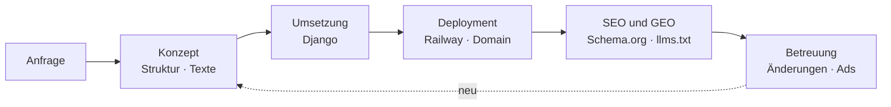

### Kundenseiten

<table>
<tr>
<td width="50%"><a href="https://www.ruempelwerk-mitteldeutschland.de">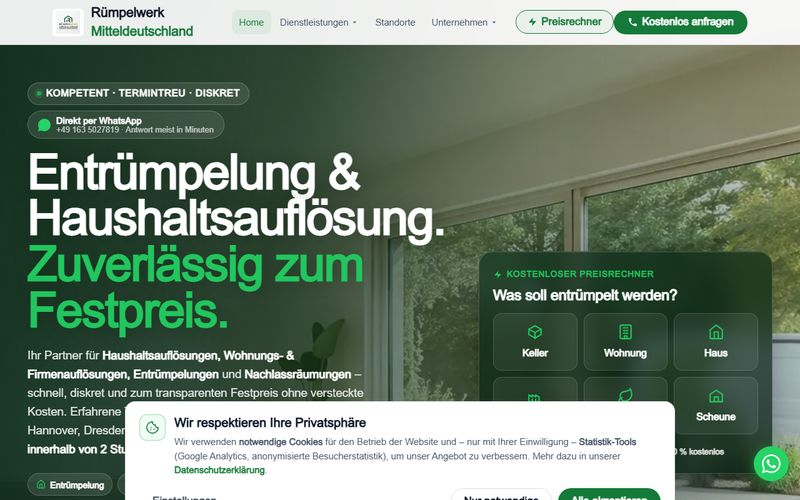</a></td>
<td width="50%"><a href="https://www.wvm-it.tech">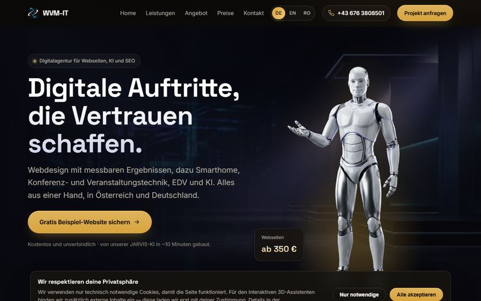</a></td>
</tr>
<tr>
<td><b><a href="https://www.ruempelwerk-mitteldeutschland.de">Rümpelwerk Mitteldeutschland</a></b> Entrümpelung &amp; Haushaltsauflösungen. Mein bestbetreutes Projekt: Seite, SEO und Google Ads aus einer Hand — <b>es kommen laufend echte Aufträge über die Seite herein.</b></td>
<td><b><a href="https://www.wvm-it.tech">WVM-IT</a></b> Österreichisches IT-Unternehmen, zugleich Auftraggeber und Kooperationspartner. Dreisprachig DE/EN/RO über ein eigenes i18n-Paket ohne <code>gettext</code>.</td>
</tr>
<tr>
<td><a href="https://rhein-neckar-production.up.railway.app">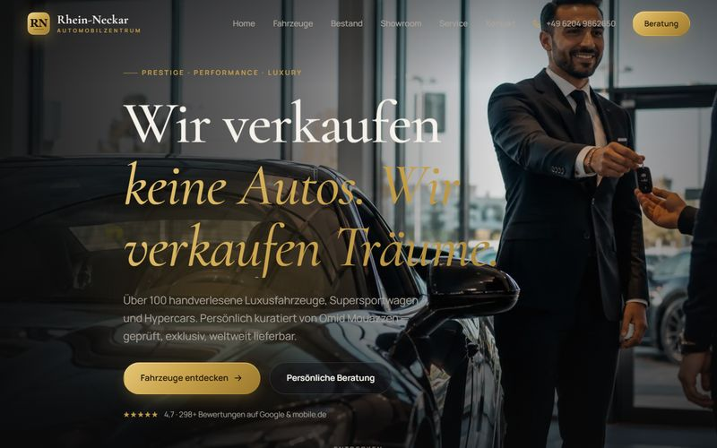</a></td>
<td><a href="https://www.luviq-alsfeld.com">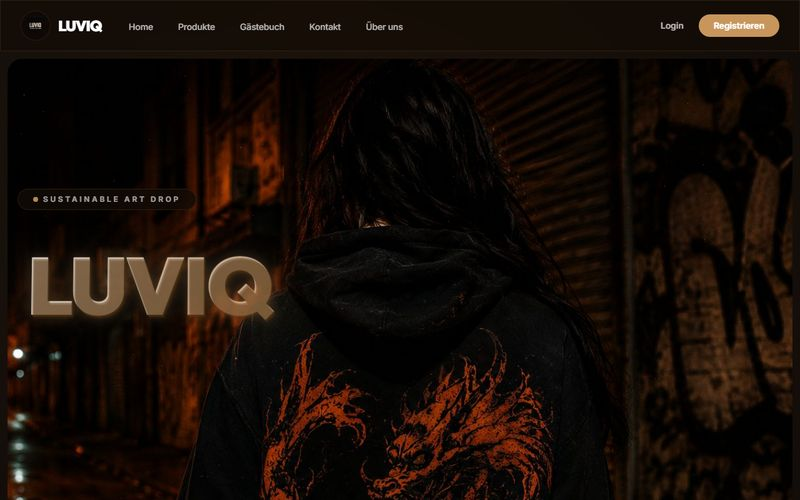</a></td>
</tr>
<tr>
<td><b><a href="https://rhein-neckar-production.up.railway.app">Automobilzentrum Rhein-Neckar</a></b> Luxus- und Sportwagenhandel. Video-Showroom, Fahrzeugkatalog, Beratungsanfrage — visuell mein aufwändigstes Projekt.</td>
<td><b><a href="https://www.luviq-alsfeld.com">Luviq Universe</a></b> Vollständiger Onlineshop für handbemalte Second-Hand-Mode: Katalog, Warenkorb, PayPal-Checkout, Konten. Mein erstes Projekt für eine andere Person.</td>
</tr>
<tr>
<td><a href="https://www.rtc-service.com">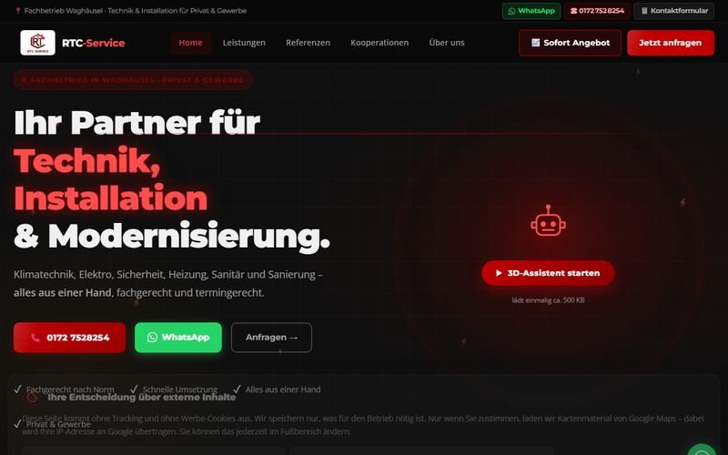</a></td>
<td><a href="https://www.hg-fluegel.de">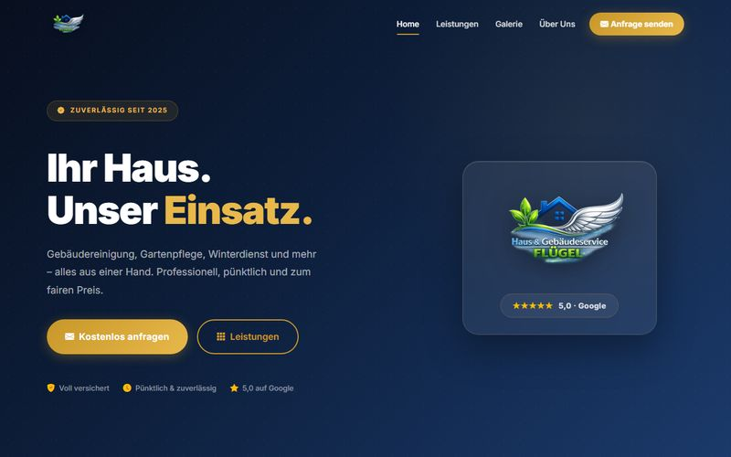</a></td>
</tr>
<tr>
<td><b><a href="https://www.rtc-service.com">RTC-Service</a></b> Technik, Installation und Modernisierung. Leistungsübersicht, Referenzen, direkte Kontaktwege über WhatsApp und Telefon.</td>
<td><b><a href="https://www.hg-fluegel.de">Flügel Haus &amp; Gebäudeservice</a></b> Gebäudereinigung und Gartenpflege. Klare Leistungsstruktur mit Angebotsanfrage als zentralem Weg.</td>
</tr>
</table>

### Mein eigenes Angebot

<a href="https://www.pystore.de">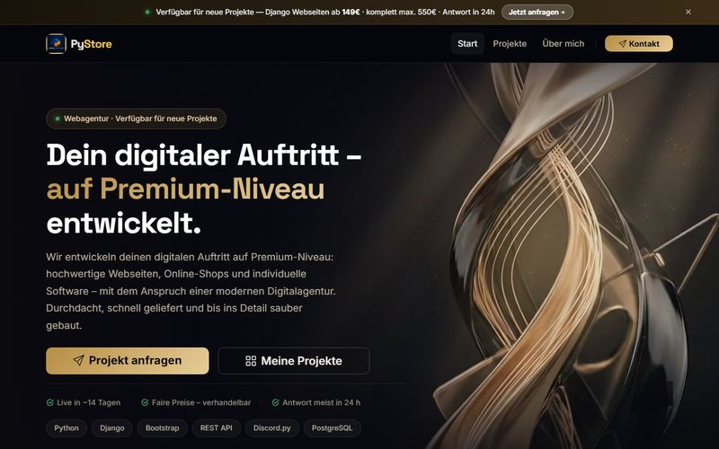</a>

**[PyStore](https://www.pystore.de)** — hierüber verkaufe ich Webseiten. Django-Multi-App mit rund 135 eigenständigen Stadtseiten für lokale Suchanfragen, FAQ- und Breadcrumb-Auszeichnung, selbst gehostete Schriften und Skripte. Lighthouse-Barrierefreiheit 100.

> **Was SEO und GEO bei mir konkret heißt:** strukturierte Daten als `@graph` statt loser Schnipsel, `FAQPage`- und `Breadcrumb`-Auszeichnung, `llms.txt` und eine für KI-Crawler geöffnete `robots.txt`, Antwort-zuerst-Texte, dazu Local-SEO für den deutschsprachigen Raum. Bei Rümpelwerk kommt die Google-Ads-Betreuung dazu.

 

---

# Reichweite


Auf TikTok veröffentliche ich als **[@python_tutorials_de](https://www.tiktok.com/@python_tutorials_de)** Python-Tutorials und zeige, woran ich gerade baue. Angefangen bei null.

Das war nie nur Nebensache. Erklären zwingt zum Verstehen — und der Kanal ist bis heute mein wichtigster Vertriebsweg: **mehrere meiner zahlenden Kunden haben mich über TikTok gefunden**, angefangen beim allerersten Auftrag, der aus einem Kommentar unter einem Video entstand.

Am besten liefen zwei Videos über meine **Scraping-Dashboards** mit **126.000** und **100.000** Aufrufen — gezeigte Projekte ziehen deutlich mehr als reine Tutorials.

 

---

# Der Weg hierher

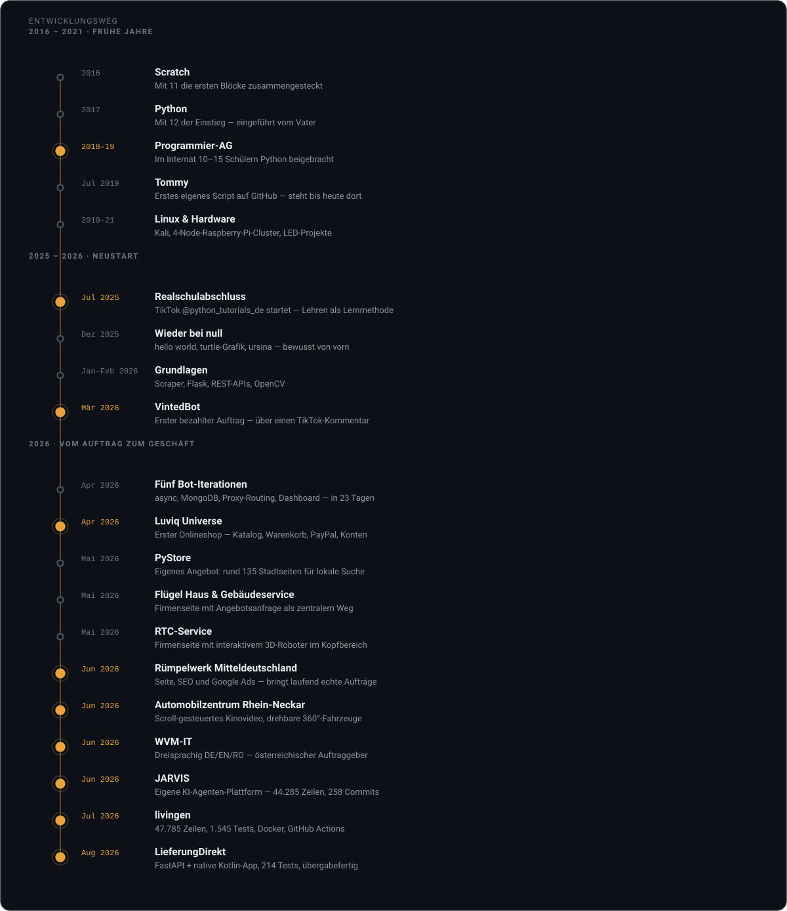

Zwei Dinge in dieser Zeitleiste haben mehr verändert als alles andere.

Das erste war die **Programmier-AG im Internat**. Zehn bis fünfzehn Mitschülern Python beizubringen zwang mich, Konzepte so weit zu durchdringen, dass ich sie erklären konnte. Wer eine `for`-Schleife dreimal unterschiedlich erklären muss, bis es klick macht, versteht sie danach selbst anders.

Das zweite war ein **Kommentar unter einem TikTok-Video**. Jemand fragte, ob ich einen Vinted-Scraper mit Discord-Anbindung bauen könne. Ich sagte zu, lieferte — und aus „Python lernen" wurde „Software für fremde Anforderungen bauen". Alles danach folgte aus diesem einen Auftrag.

 

# Fähigkeiten


> Die Einstufungen sind aus gemessener Nutzung abgeleitet, nicht geschätzt: Codezeilen, Testfunktionen und produktive Projekte. Wo ich schwach bin, steht das genauso da wie das, was ich kann.

 

---

# Weitere Projekte

Neben den Webseiten entstehen Werkzeuge, die konkrete Arbeit abnehmen.

## LieferungDirekt — Bestellsystem für ein Restaurant

FastAPI-Backend mit PostgreSQL und Redis, dazu eine native Android-App in Kotlin und Jetpack Compose. Bestellungen lösen im Laden einen Alarm aus — ohne Firebase, über einen eigenen Long-Polling-Kanal. Für Betreiberkonten ist Zwei-Faktor-Authentifizierung per TOTP Pflicht.

Der Teil, auf den ich am meisten Wert gelegt habe, steht nicht im Code: Der Wirt pflegt Speisekarte, Fotos, Stammdaten und Rechtstexte selbst in der App. Das System gehört nach der Übergabe ihm, nicht mir.

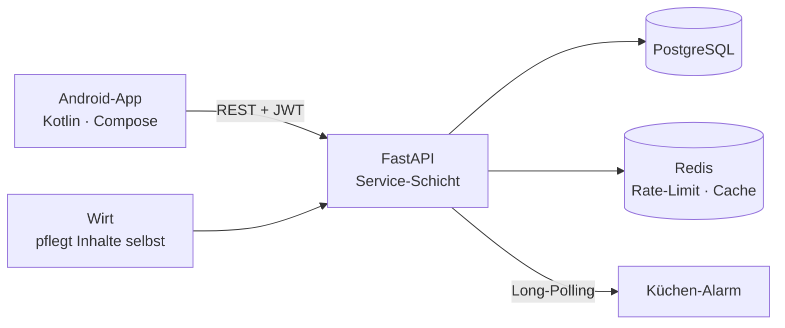

`17.744` Zeilen Python · `13.174` Zeilen Kotlin · `214` Tests · Docker · 10 Doku-Dateien
Privates Repository — der Kunde hat es noch nicht abgenommen.

---

## livingen — Wohnungs-Pipeline mit Discord-Ausspielung

Scrapt Mietwohnungsangebote, sortiert sie nach Bundesland und spielt sie über einen Discord-Bot aus. Technisch mein saubersten gebautes Projekt: das einzige mit durchgehender Testabdeckung, Docker und GitHub Actions.

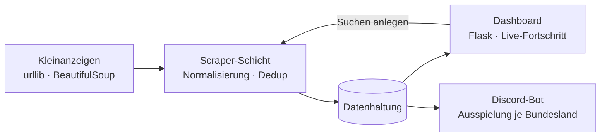

`47.785` Zeilen Python · `1.545` Testfunktionen in `137` Dateien · Docker · CI

**→ [Zur Seite](https://livingen-web-production.up.railway.app)**

---

## JARVIS — Lead-Pipeline und Website-Generator

Deckt den Weg von der Lead-Recherche bis zur fertig deployten Kundenwebseite ab. Entstanden aus einem praktischen Problem: Der zeitaufwändigste Teil meiner Arbeit war nie das Programmieren, sondern Betriebe finden, Kontakte recherchieren, Inhalte zusammentragen, aufsetzen, deployen.

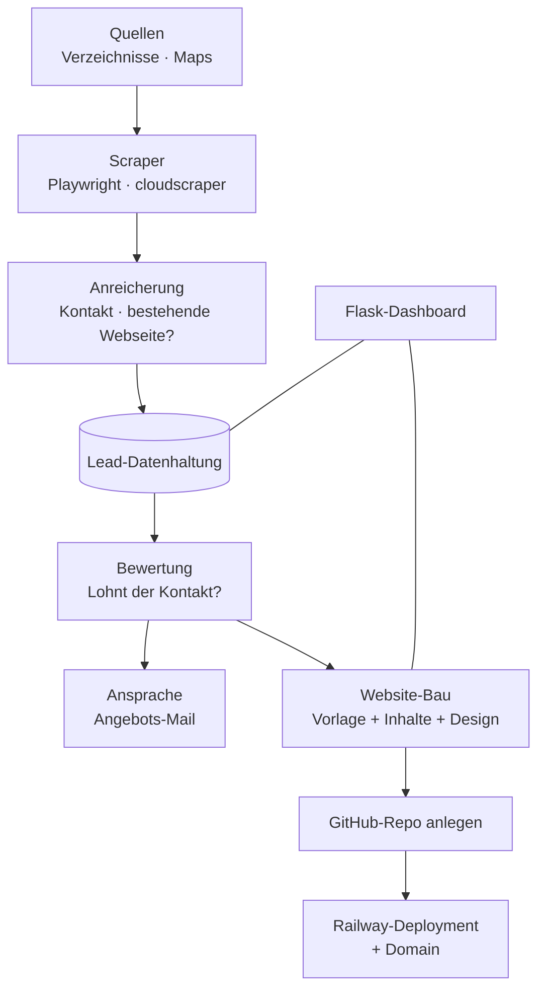

Ehrlich eingeordnet: Die Idee trägt weiter als die Umsetzung. Bei `44.285` Zeilen stehen nur `258` Testfunktionen in vier Dateien, es gibt kein Docker-Setup und keine CI. Genau das ist die Baustelle, an der ich gerade arbeite.

`44.285` Zeilen Python · `189` Module · `258` Commits

**→ [Repository](https://github.com/BastianScherzinger/jarvis2)**

---

## MEDIAPIPE WVM — KI-Video-Studio

Auftragsarbeit: aus einem Briefing entsteht ein Drehbuch, daraus werden Videoszenen erzeugt und anschließend in alle benötigten Ausgabeformate geschnitten. Ein Durchlauf, der vorher aus vielen Einzelwerkzeugen bestand.

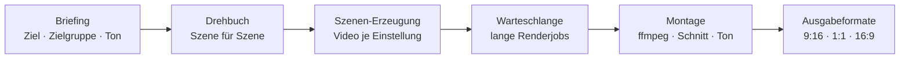

`8.147` Zeilen Python · `181` Tests · Flask · ffmpeg · ausführlichste Dokumentation aller meiner Projekte

**→ [Repository](https://github.com/BastianScherzinger/mediapipe-wvm)**

---

## Luviq Universe — Onlineshop

Der Django-Shop hinter [luviq-alsfeld.com](https://www.luviq-alsfeld.com). Die Views habe ich nachträglich von einer einzelnen Datei in ein Package nach Zuständigkeiten aufgeteilt — ab etwa tausend Zeilen war jede Änderung eine Sucherei geworden. Das ist die Lektion, die ich aus diesem Projekt mitgenommen habe.

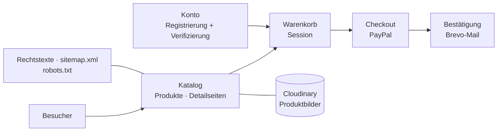

`Django 5` · `PostgreSQL` · `PayPal` · `Cloudinary` · `Brevo` · `django-axes` · Docker

**→ [Zur Seite](https://www.luviq-alsfeld.com)** · **[Repository](https://github.com/BastianScherzinger/Webseitemitstripe)**

---

## VintedBot — mein erster bezahlter Auftrag

Ein Discord-Bot, der Vinted-Suchen überwacht und Treffer meldet. Die erste Fassung steuerte einen echten Browser und brauchte rund 1,5 GB Arbeitsspeicher — zu viel für das Hosting-Paket. Ich habe den Browser entfernt und das HTML direkt geparst: Speicherbedarf unter 200 MB.

Das war mein erstes echtes Architektur-Problem. Nicht „funktioniert es?", sondern „funktioniert es unter den Bedingungen, die tatsächlich gelten?".

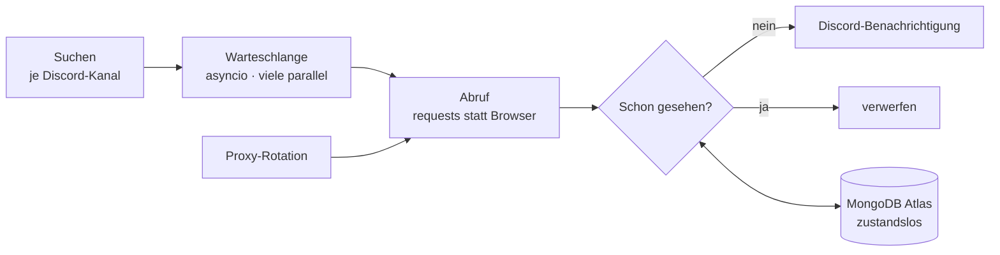

`Python` · `asyncio` · `discord.py` · `MongoDB` · `Docker`

**→ [Repository](https://github.com/BastianScherzinger/VintedBot)**

 

---

# Was schon vor der Ausbildung steht

Meine Ausbildung zum Fachinformatiker für Anwendungsentwicklung beginnt 2027. Einige Lernfelder decken sich bereits mit dem, was ich gebaut habe:

| Bereich | Belegt durch |
|---|---|
| Software modellieren und programmieren | 15 Projekte, `170.668` Zeilen Python |
| Datenbanken anlegen und nutzen | PostgreSQL, SQLite, Supabase inklusive Row-Level-Security |
| Anwendungen mit Schnittstellen | Eigenes FastAPI-Backend, Anbindung mehrerer externer APIs |
| Qualitätssicherung und Testen | `2.324` Testfunktionen — schwerpunktmäßig in zwei Projekten |
| Sicherheit | TOTP-Zweifaktor, JWT mit Rotation, Rate-Limiting, RLS |
| Benutzeroberflächen | Native Android-App, sieben produktive Weboberflächen |
| Kundenkommunikation | Acht zahlende Kunden, Übergaben, laufende Betreuung |
| Netzwerke und Betriebssysteme | Linux, Raspberry-Pi-Cluster, Deployment und Domainverwaltung |

Was noch fehlt: strukturierte CI/CD über alle Projekte hinweg, Datenbank-Optimierung und Arbeit im Team mit Branches und Code-Reviews. Daran arbeite ich gezielt.

 

# Woran ich gerade arbeite

- **LieferungDirekt** zur Abnahme bringen
- **Testabdeckung und CI** auf die älteren Projekte ausweiten — der größte Abstand zu sauberer Arbeit
- **`ruff` und Type-Hints** als Standard in jedem neuen Projekt
- Perspektivisch die Selbstständigkeit mit Webentwicklung und SEO

 

# Kontakt

Alle Kennzahlen auf dieser Seite sind gemessen: Codezeilen über <code>find</code> und <code>wc</code> ohne Fremdbibliotheken, Testfunktionen über <code>def test_</code>, Commits aus der Git-Historie, Seiten per HTTP-Abruf geprüft. Die Reichweiten-Zahlen stammen aus der TikTok-Statistik des Kanals, Stand August 2026.
