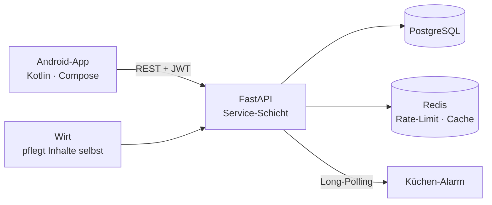
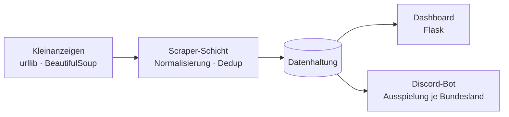

### Hallo, ich bin Bastian.

Ich baue Software, die tatsächlich benutzt wird — Buchungs- und Bestellsysteme, Scraping-Pipelines, Kundenwebseiten. Angefangen habe ich mit 11 bei Scratch. Im Juli 2025, direkt nach dem Realschulabschluss, habe ich bewusst wieder bei `hello world` begonnen und seitdem nicht mehr aufgehört.

Was dabei entstanden ist, steht unten — mit Zahlen, die man nachrechnen kann, und Seiten, die man aufrufen kann.

**Aktuell:** freiberufliche Kundenprojekte · **Ab 2027:** Ausbildung zum Fachinformatiker für Anwendungsentwicklung

 

## Der Weg hierher

Zwei Dinge in dieser Zeitleiste haben mehr verändert als alles andere.

Das erste war die **Programmier-AG im Internat**. Zehn bis fünfzehn Mitschülern Python beizubringen zwang mich, Konzepte so weit zu durchdringen, dass ich sie erklären konnte. Wer eine `for`-Schleife dreimal unterschiedlich erklären muss, bis es klick macht, versteht sie danach selbst anders.

Das zweite war ein **Kommentar unter einem TikTok-Video**. Jemand fragte, ob ich einen Vinted-Scraper mit Discord-Anbindung bauen könne. Ich sagte zu, lieferte — und aus „Python lernen" wurde „Software für fremde Anforderungen bauen". Alles danach folgte aus diesem einen Auftrag.

 

## Fähigkeiten

> Die Einstufungen sind aus gemessener Nutzung abgeleitet, nicht geschätzt: Codezeilen, Testfunktionen und produktive Projekte. Wo ich schwach bin, steht das genauso da wie das, was ich kann.

 

## Ausgewählte Projekte

### LieferungDirekt — Bestellsystem für ein Restaurant

Vollständiges Bestellsystem für ein reales Lokal: FastAPI-Backend mit PostgreSQL und Redis, dazu eine native Android-App in Kotlin und Jetpack Compose. Bestellungen lösen im Laden einen Alarm aus — ohne Firebase, über einen eigenen Long-Polling-Kanal. Für Betreiberkonten ist Zwei-Faktor-Authentifizierung per TOTP Pflicht.

Der Teil, auf den ich am meisten Wert gelegt habe, steht nicht im Code: Der Wirt pflegt Speisekarte, Fotos, Stammdaten und Rechtstexte selbst in der App. Das System gehört nach der Übergabe ihm, nicht mir.

`17.744` Zeilen Python · `13.174` Zeilen Kotlin · `214` Tests · Docker · 10 Doku-Dateien
Privates Repository — der Kunde hat es noch nicht abgenommen.

---

### livingen — Wohnungs-Pipeline mit Discord-Ausspielung

Scrapt Mietwohnungsangebote, sortiert sie nach Bundesland und spielt sie über einen Discord-Bot aus. Technisch mein saubersten gebautes Projekt: das einzige mit durchgehender Testabdeckung, Docker und GitHub Actions.

`47.785` Zeilen Python · `1.545` Testfunktionen in `137` Dateien · Docker · CI

**→ [Zur Seite](https://livingen-web-production.up.railway.app)**

---

### JARVIS — KI-Agenten-Plattform

Eigene Plattform, die aus einem Auftrag heraus komplette Kundenwebseiten baut: Recherche, Inhaltserstellung, Design-Durchgang, Deployment. Über vier Generationen gewachsen und mein ambitioniertestes Projekt — mit `258` Commits allein in Generation 2.

Ehrlich eingeordnet: Die Idee trägt weiter als die Umsetzung. Bei `44.285` Zeilen stehen nur `258` Testfunktionen in vier Dateien, es gibt kein Docker-Setup und keine CI. Genau das ist die Baustelle, an der ich gerade arbeite.

`44.285` Zeilen Python · `189` Module · `258` Commits

**→ [Repository](https://github.com/BastianScherzinger/jarvis2)**

---

### MEDIAPIPE WVM — KI-Video-Studio

Desktop-Werkzeug, das aus einem Briefing ein Drehbuch erzeugt, daraus Videoszenen generieren lässt und sie in alle benötigten Ausgabeformate schneidet. Entstanden als Auftragsarbeit, mit `181` Testfunktionen und der ausführlichsten Dokumentation aller meiner Projekte.

`8.147` Zeilen Python · `181` Tests · Flask · ffmpeg

**→ [Repository](https://github.com/BastianScherzinger/mediapipe-wvm)**

 

## Kundenprojekte

Alle Seiten sind live und wurden von mir gebaut — Entwicklung, Deployment, Domain und laufende Betreuung.

| Projekt | Was es ist | Meine Rolle |
|---|---|---|
| **[Rümpelwerk Mitteldeutschland](https://www.ruempelwerk-mitteldeutschland.de)** | Entrümpelung & Haushaltsauflösungen | Seite, SEO-Betreuung, Google Ads — bringt laufend echte Aufträge |
| **[WVM-IT](https://www.wvm-it.tech)** | Österreichisches IT-Unternehmen | Firmenseite, dreisprachig DE/EN/RO · zugleich Auftraggeber und Kooperationspartner |
| **[RTC-Service](https://www.rtc-service.com)** | Technik, Installation, Modernisierung | Komplette Firmenseite |
| **[Luviq Universe](https://www.luviq-alsfeld.com)** | Handbemalte Second-Hand-Mode, Alsfeld | Komplette Seite — mein erstes Projekt für eine andere Person |
| **[Flügel Haus & Gebäudeservice](https://www.hg-fluegel.de)** | Reinigung, Garten, Hausservice | Komplette Firmenseite |
| **[Automobilzentrum Rhein-Neckar](https://rhein-neckar-production.up.railway.app)** | Luxus- und Sportwagenhandel | Django-Neubau mit Video-Showroom |
| **[PyStore](https://www.pystore.de)** | Mein eigenes Webseiten-Angebot | Django-Multi-App, rund 135 SEO-Stadtseiten |

Für WVM-IT sind zusätzlich **JARVIS** und **livingen** entstanden — beides interne Werkzeuge, keine Kundenseiten.

Nicht in der Tabelle, weil es keine Webseiten sind: der **Vinted-Scraper mit Discord-Anbindung** (mein erster bezahlter Auftrag) und **LieferungDirekt**. Zusammen mit den Seiten oben sind das acht zahlende Kunden.

 

## Was schon vor der Ausbildung steht

Meine Ausbildung zum Fachinformatiker für Anwendungsentwicklung beginnt 2027. Einige Lernfelder decken sich bereits mit dem, was ich gebaut habe:

| Bereich | Belegt durch |
|---|---|
| Software modellieren und programmieren | 15 Projekte, `170.668` Zeilen Python |
| Datenbanken anlegen und nutzen | PostgreSQL, SQLite, Supabase inklusive Row-Level-Security |
| Anwendungen mit Schnittstellen | Eigenes FastAPI-Backend, Anbindung mehrerer externer APIs |
| Qualitätssicherung und Testen | `2.324` Testfunktionen — schwerpunktmäßig in zwei Projekten |
| Sicherheit | TOTP-Zweifaktor, JWT mit Rotation, Rate-Limiting, RLS |
| Benutzeroberflächen | Native Android-App, sieben produktive Weboberflächen |
| Kundenkommunikation | Acht zahlende Kunden, Übergaben, laufende Betreuung |
| Netzwerke und Betriebssysteme | Linux, Raspberry-Pi-Cluster, Deployment und Domainverwaltung |

Was noch fehlt: strukturierte CI/CD über alle Projekte hinweg, Datenbank-Optimierung und Arbeit im Team mit Branches und Code-Reviews. Daran arbeite ich gezielt.

 

## Woran ich gerade arbeite

- **LieferungDirekt** zur Abnahme bringen
- **Testabdeckung und CI** auf die älteren Projekte ausweiten — der größte Abstand zu sauberer Arbeit
- **`ruff` und Type-Hints** als Standard in jedem neuen Projekt
- Perspektivisch ein eigenes Unternehmen für Webentwicklung

 

## Kontakt

Auf TikTok habe ich als **@python_tutorials_de** angefangen, Python-Tutorials zu veröffentlichen — nicht als Nebensache, sondern weil Erklären die schnellste Art zu lernen war. Meine ersten Kunden kamen von dort.

Alle Kennzahlen auf dieser Seite sind gemessen: Codezeilen über <code>find</code> und <code>wc</code> ohne Fremdbibliotheken, Testfunktionen über <code>def test_</code>, Commits aus der Git-Historie, Seiten per HTTP-Abruf geprüft.
